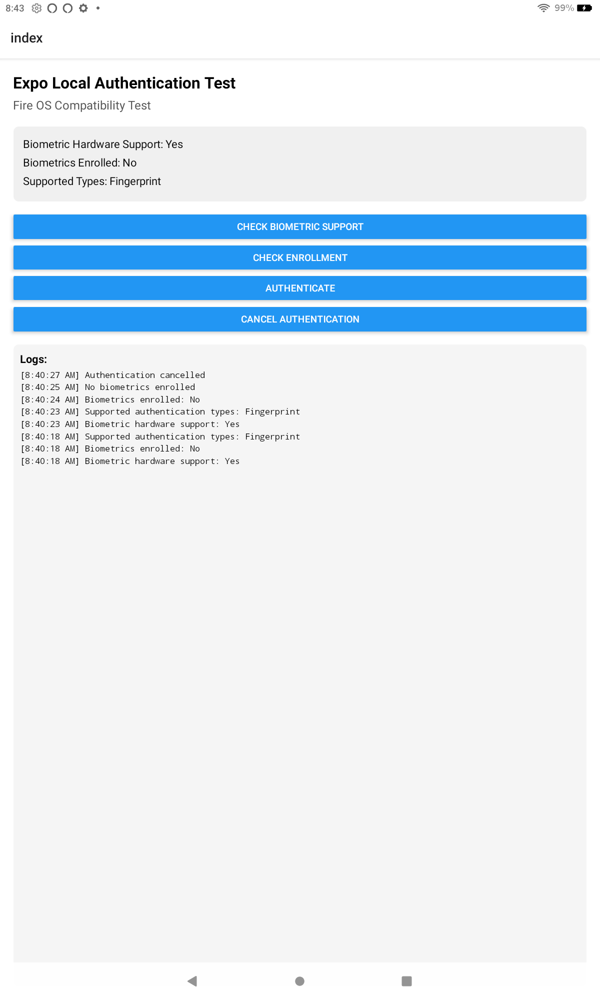

# Expo Local Authentication Test for Fire OS

This app tests the functionality of the expo-local-authentication package on Fire OS devices.



## Features

- **Biometric Hardware Support Detection**: Checks if the device has biometric hardware
- **Biometric Enrollment Check**: Verifies if biometrics are enrolled on the device
- **Authentication Testing**: Tests biometric authentication functionality
- **Cancellation Testing**: Tests cancellation of authentication process
- **Detailed Logging**: Provides real-time logs of all authentication operations

## Test Results

As shown in the screenshot, the app detected:
- Biometric Hardware Support: Yes
- Biometrics Enrolled: No
- Supported Types: Fingerprint

## Setup Instructions

### Prerequisites
- Node.js and npm installed
- Expo CLI installed (`npm install -g expo-cli`)
- A Fire OS device (Fire tablet or Fire TV)
- Developer options enabled on your Fire OS device

### Installation

1. Clone this repository:
   ```
   git clone https://github.com/mosesroth/fire-os-local-auth.git
   cd fire-os-local-auth
   ```

2. Install dependencies:
   ```
   npm install
   ```

3. Start the app:
   ```
   npx expo start
   ```

### Building for Fire OS

1. Build the app for Android:
   ```
   npx expo prebuild --platform android
   cd android
   ./gradlew assembleDebug
   ```

2. The APK will be generated at `android/app/build/outputs/apk/debug/app-debug.apk`

3. Install the APK on your Fire OS device

## Fire OS Compatibility Notes

- Fire OS is based on Android, but some devices may have limited biometric capabilities
- Fingerprint authentication is more likely to be supported than facial recognition
- The app logs all operations and their results for debugging purposes

## Technologies Used

- React Native
- Expo
- expo-local-authentication
